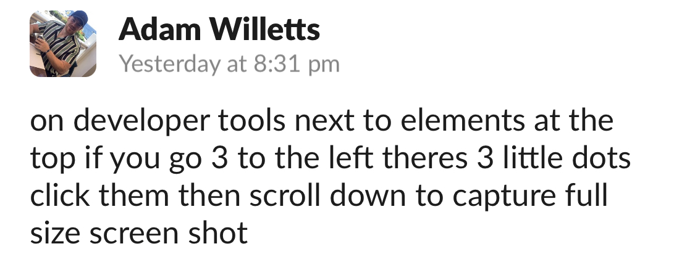

# Horiseon Code Refactor Challenge

## Project detail

- I was given this project and I was asked to organise and refactor it.

- I added semantic tags to make the content more accessible to people with disabilities and to improve search engine optimisation.

- Several CSS declaratiogns were also removed and consolidated into single sections that follow the new semantic tags.

- Comments were added to the CSS file to make the code more readable and understandable.

## Links
- https://www.w3.org/WAI/GL/wiki/ARIATechnique_usingImgRole_with_aria-label_forCSS-backgroundImage
- https://www.w3schools.com/html/html5_semantic_elements.asp
- https://developer.mozilla.org/en-US/docs/Web/HTML/Element/Heading_Elements
- Adam Willetts:
- 

